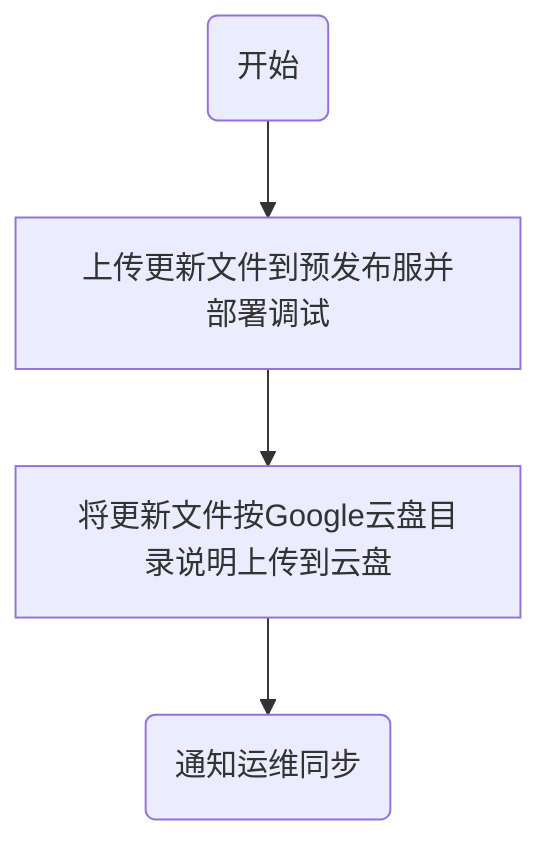

# 软件更新流程
## 服务端

### 更新文件应用方法

1. 在 管理系统后台 -> 运营配置 -> 维护配置 开启停服维护模式
2. 等待一定时间，确认没有玩家在线(通过后台在线玩家列表确认)
3. 停止服务端程序运行
4. 覆盖更新文件
5. 启动服务端程序
6. 客户端用白名单账号登录，确认更新效果
7. 管理后台将状态改为正常运行

## 客户端

### 打包

|名称|包名|api接口地址|说明|
|----|----|----|----|
|ok电玩||http://127.0.0.1:8081|生产环境，以下称正式版|
|测试版|test.com|http://api.test.com|内网测试环境|
|开发版|abc158.xyz|http://api.abc158.xyz|测试环境|

小版本更新打测试版、开发版两个包，测试无问题后打正式版的包

### 分发

#### 开发版

将apk包上传至预发布服，覆盖目录

> D:\Resources\apk\

中的app.apk

苹果流程暂未定

#### 测试版、正式版

按[Google云盘目录说明](./README.md)将安卓、苹果的包上传至对应目录即可。**上传压缩包不要直接上传文件**。

### 资源文件更新

#### 开发版

将资源文件上传至预发布服

> D:\Resources

目录下对应的设备、对应的版本号目录下

#### 测试版、正式版

按[Google云盘目录说明](./README.md)将安卓、苹果的资源包上传至对应目录即可。**上传压缩包不要直接上传文件**。

